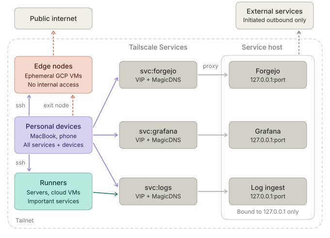

# How I Self-Host [WIP]

## Design Principles

### Everything is declared

#### The Constraint

#### The Decision

#### The Tradeoff

### Nothing is exposed

#### The Constraints

As privacy was a key motivator for self-hosting, I needed a cohesive solution for secure networking. Personal devices had to access services hosted at home and in the cloud while ensuring that those services were not exposed to the open internet. At the host level, no ports should be published without both an authorization mechanism and encryption.

#### The Decisions

All devices are connected to a single Tailnet and assigned to one of three trust tiers:

- Personal devices (mobile, laptop): allowed to SSH into all runners and access all services.
- Runners (servers, VMs): limited to accessing core services (e.g. log sink) to enable standard operation while restricting abitrary traversal.
- Edge proxy nodes (ephemeral cloud VMs): restricted from accessing any internal resources as they are externally controlled and don't require any sensitive access.

Each service listens only on loopback. Reaching one from another device goes through the Tailnet; Tailscale terminates the connection on the host and forwards it to the local port. This route means every connection is encrypted, explicitly allowed by ACL rules, and addressed by a name that Tailscale resolves. No host listens on a public interface.

#### The Tradeoffs

Tailscale is a hard dependency, though its mesh topology means authenticated devices can continue to securely communicate with each other while the central server is unavailable.

Zero public exposure means that I can't use webhooks for real-time triggers or alerts. This has been mitigated by configuring my services to use soon-enough polling, balancing latency against request volume and power draw.

Sharing a service with another person means adding them to the Tailnet or breaking this principle.

A compromised personal device can access everything.

### Assume it will fail

#### The Constraint

#### The Decision

#### The Tradeoff
