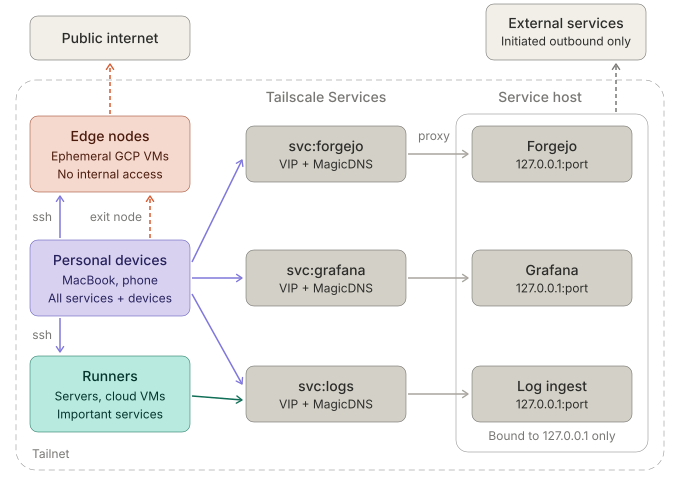

# How I Self-Host [WIP]

## Design Principles

### Everything is declared

#### The Situation

My servers were built up incrementally. Services were onboarded, tools were installed, and secrets were stashed wherever was convenient at the time. The running state of each machine was the only record of how it was configured, and the only way to read it was to log in and look. Upgrading a program or rotating a key meant visiting every host and making the change by hand, and the drift showed: logging pipelines used inconsistent formats, and the same CLI tool expected different arguments depending on where I ran it. Nothing described how to rebuild a server beyond what I could remember to install.

My first fix was a custom server management system. It ended up being a better lesson in the complexities of multi-host management than it was a reliable tool. What I actually needed was a platform that let me focus on designing the servers rather than maintaining the tooling.

#### The Solution

A single Ansible project defines every service and host I run. Each service, whether a single Docker container or a multi-role log pipeline, declares its own dependencies, configuration, and secrets in one place, so the project describes not just what runs but how the pieces fit together.

Secrets are tracked alongside the rest of the configuration to ensure that they are imported properly and backed up. To ensure that they aren't exposed, SOPS is used to encrypt secret values before they are committed.

Being able to back up the entire configuration, secrets and all, means that I can redeploy changes from anywhere, as long as I have access to my SOPS decryption key. With service state also backed up (see [Assume it will fail](#assume-it-will-fail)), onboarding a new or rebuilt host is straightforward.

Every service follows a similar shape. Here is the layout for one of the simpler ones, a budgeting app:

```
inventory.yaml                  # which hosts run it
playbooks/actual.yaml           # links those hosts to the role
roles/actual/
  defaults/main.yaml            # image version, ports, paths
  tasks/main.yaml               # container, backups, tailnet publish
  tasks/backup.yaml
  templates/actual-backup.*.j2  # systemd timer + export script
group_vars/actual/
  main.yaml                     # which budgets to back up
  secrets.sops.yaml             # encrypted server password
```

The role's main task file reads as a summary of everything the service needs. The container and its data directory, backups, and network exposure are each one step, and the step for exposure is shared with every other service:

```yaml
# trimmed for brevity

- name: Create actual data dir
  ansible.builtin.file:
    path: "{{ actual_data_dir }}"

- name: Start actual container
  community.docker.docker_container:
    name: actual
    volumes:
      - "{{ actual_data_dir }}:/actual"

- name: Configure backups
  ansible.builtin.import_tasks: backup.yaml

- name: Publish as a tailscale service
  ansible.builtin.import_role:
    name: tailscale_service
```

Secrets sit next to the rest of the configuration and are decrypted only at deploy time:

```yaml
# group_vars/actual/secrets.sops.yaml
actual_backup_password: ENC[AES256_GCM,data:UQfd...,type:str]
```

#### The Tradeoffs

Manual changes are either overwritten or unnoticed. It takes discipline to make every change through the config rather than directly on the server.

State data is not included. Storage and backup strategies can be defined and deployed with Ansible, but the data must live elsewhere.

Initial machine setup must be handled separately. Setting up the OS, creating the user, and authenticating to the Tailnet must be done manually or with an image builder (e.g. Packer).

The SOPS decryption key is a single point of failure. Per-host keys would limit a leak's blast radius to a single host's secrets, but at this scale that's not a meaningful security gain over disciplined single-key hygiene.

### Nothing is exposed

#### The Situation

I need access to my services and data while away from my home network in a way that ensures privacy and security.

My ISP gives me a dynamic address behind CGNAT, so inbound connections to home servers aren't reliably available. I'm also the only operator, so anything that requires routine upkeep (cert pipelines, etc.) will likely get neglected.

Previous experiences running everything privately on GCP and AWS were complex and expensive enough to be unsustainable. Commercial VPNs that support device-to-device access exist, but can have questionable data privacy practices.

#### The Solution

All devices are connected to a single Tailnet and assigned to one of three trust tiers:

- Personal devices (mobile, laptop): allowed to SSH into all hosts and access all services.
- Hosts (servers, VMs): limited to accessing core services (e.g. log sink) to enable standard operation while restricting arbitrary traversal.
- Exit nodes (ephemeral cloud VMs): forward my devices' outbound traffic on untrusted networks. They don't need to reach anything internal, so they get no access.

Each service listens only on loopback. Reaching one from another device goes through the Tailnet; Tailscale terminates the connection on the host and forwards it to the local port. This route means every connection is encrypted, explicitly allowed by ACL rules, and addressed by a name that Tailscale resolves. No host listens on a public interface.



#### The Tradeoffs

Tailscale is a hard dependency, though its mesh topology means authenticated devices can continue to securely communicate with each other while the central server is unavailable.

Zero public exposure means that I can't use webhooks for real-time triggers or alerts. This has been mitigated by configuring my services to poll at intervals that balance latency against request volume and power draw.

Sharing a service with another person requires onboarding them to the Tailnet.

A compromised personal device can access everything. As of now, this is an accepted risk since these are the devices I admin from.

### Assume it will fail

#### The Situation

Services are now on hardware I own. Instead of relying on cloud providers' built-in replication and backups, I am now solely responsible if something fails.

Especially on unreliable local storage like my Raspberry Pi's SD card, hosts and services must be administered with an assumption that they will eventually fail. Ansible handles rebuilding the host; the only open question is how much of the state to save.

Backing up the data is only the first step. A backup is only useful if it can be restored, so data integrity must be regularly verified.

#### The Solution

Each service's state data is delineated between critical and expendable depending on whether I can afford to lose it after a hardware failure. For my git forge, that sorting looks like this:

| Data                                    | Category      | Where it lives                  |
| --------------------------------------- | ------------- | ------------------------------- |
| Image version, runner config, secrets   | Configuration | Ansible repo                    |
| Repositories, issues, user accounts     | Critical      | Nightly dump pushed to R2       |
| Package builds, action run logs, caches | Expendable    | Local disk, recreated on demand |

Every service agrees on two things: Ansible defines how it runs, and whatever data it needs to keep survives as a snapshot in one R2 bucket, pushed by rclone. Snapshotting logic is defined per service, so mature projects can use established backup systems while smaller ones can get by with smaller, purpose-built scripts. Snapshots are retained until three subsequent days of successful backups are saved.
Edge proxy nodes
Today I check backups by manually running health checks after each version bump or change to the backup script. The next step is to deploy a verification stage that creates a new instance of the service, mounts the backed up data to it, and confirms that it loads correctly.

#### The Tradeoffs

Requires trusting a third party service with my most critical data. At this stage this is accepted, but I am exploring encrypting these backups at rest.

Daily full backups require a lot of expensive storage space. Limiting the number of snapshots is okay for now, but using differential or incremental backups would reduce costs.

Manual checks can be unreliable and forgotten. Previously mentioned verification stage will address this.
